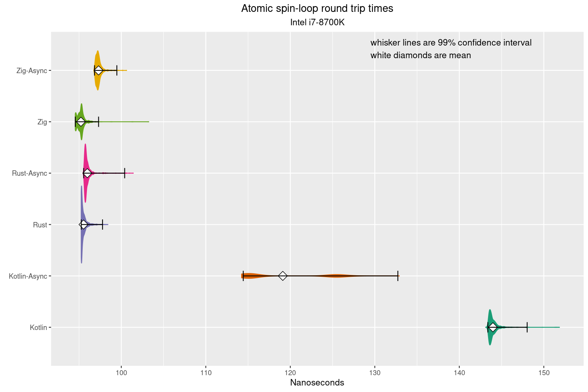
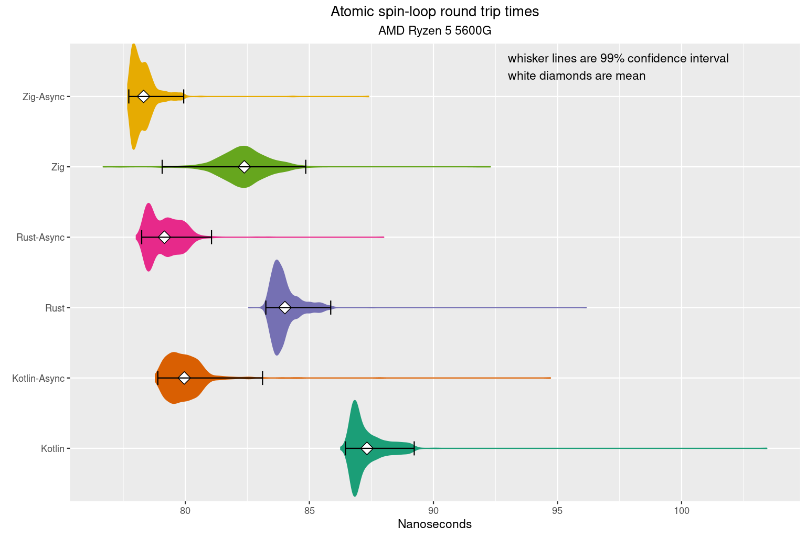

# async-benchmarks

##Benchmarking the overhead of async/coroutine IO vs procedural IO in Rust, Zig, C++ & Koltin.

#### TLDR; at end
## Background

I used to work at places that specialize in Ultra Low Latency (ULL) development, like Stock Exchanges and High Frequency Trading and the like. As you can imagine the engineering that goes into ULL systems is massive. But you end up having to bypass good abstractions and libraries because of the overhead. A good example is : It is rare ULL code that does a context switch (takes too long). Single threaded only. If you want to communicate w/ another process, you use shared memory. ULL code rarely calls epoll/select either. Best to avoid the kernel as well (evfi,dkdp,openonload,etc). So you end up doing some sort of `while(!hasNewData()) {}` spinning event loop, waiting for memory to change, and when it does you enter callback-hell. The ergonomics suck. Or just give up and learn verilog, put your code on the card w/ the NIC and skip the PCIe bus/kernel/stack all together. Your shinny CPU now just branch predicting a glorified logger.

## Motovation

I recently did another project for a company in an adjacent industry, and I ended up using koltin coroutines for that project (not ULL, but still latency focused). It was great to write procedural looking code that was concurrent. I really enjoyed that project. It made the code so much easier to write / reason about / read.

I might have another ULL project coming up, but they don't want to go the FPGA route (or as little as possible). So before that project happens I thought I would measure the overhead of async code vs prodeural. See how much the abstraction costs so I can make informed decisions about it's usage. I'm sharing this work in case anyone else is curious.

## Methodology

I expected the async overhead to be small, but to exist. So whatever I was doing in a async manor coud not dominate the results. So networking code was out. I decided to used shared memory instead of the network and do a ping-pong test. The clint puts a `u64` in a memory location one, and times how long it takes that `u64` number to show up in memory location two. The server is spinning waiting for location one to change value, when it does it copies the new value to location two, then loops. Here is the server-side zig code, which I think is the easiest to follow:


<table>
<tr>
<td>

```zig
fn runLoop( clientPtr : *const u64, serverPtr : *u64 ) void {

    var lastValue : u64 = 0;

    while(true) {
        lastValue = spinUntilChange( clientPtr, lastValue );
        @atomicStore(u64, serverPtr, lastValue, std.builtin.AtomicOrder.Monotonic );
    }
}
fn spinUntilChange( spinPtr:*const u64, lastValue:u64) callconv(.Inline) u64 {

    var newValue = lastValue;

    while( newValue == lastValue ) {
        std.atomic.spinLoopHint();
        newValue = @atomicLoad(u64, spinPtr, std.builtin.AtomicOrder.Monotonic );
    }
    return newValue;
}
```

</td>
<td>

```asm
runLoop:
        xor     eax, eax
.LBB0_1:
        pause
        mov     rcx, qword ptr [rdi]
        cmp     rcx, rax
        je      .LBB0_1
        mov     qword ptr [rsi], rcx
        mov     rax, rcx
        jmp     .LBB0_1
```

</td>
</tr>
</table>

In C++,Rust & Zig I implmneted the pointer as both `volatile` and `Atomic`. It made no difference in the `asm` output. The Rust `asm` looks identical. C++ w/ clang looks identical, but gcc does a extra memory read in the inner loop. I did not export the resulting `asm` that the JIT optomizer came up with.

There is only one client, and it's in Rust. Mostly because the [criterion benchmarking crate](https://bheisler.github.io/criterion.rs/book/criterion_rs.html) is really great at this kind of microbenchmark stuff. So we're really only measure 1/2 the difference, assuming both sides use the same code. The `asm` for the client loop looks the same as the server loop.

For the async server code, this is the kotlin version which is probably the easiest to follow :
```kotlin
    suspend fun asyncLoop() {
        var value = 0L
        while(true) {
            value = suspendPoint.suspendMe()
            writeBuf.writeLong(0,value)
        }

    }

    fun run() {
        var nextValue = 0L;
        var lastValue = 0L;
        while(true) {
            while(nextValue == lastValue) {
                java.lang.Thread.onSpinWait();
                nextValue = readBuf.readLong(0)
            }
            suspendPoint.resume( nextValue )
            lastValue = nextValue
        }
    }
``` 
`asyncLoop()` is called first, then `run()` both from `main()`. It's odd to see two `while(true)` loops in single threaded code. `run()` is not called from a `suspend` context, it's just normal code. The compiler is just stashing state, and turns `asyncLoop()` into a call back. You can think of `resume()` as a callback-call, and `suspendMe()` as setting the next callback, then returning. I don't think I'm explaining it well, so if you don't grok it, blame it on me. There are tons of great explications on coroutines kicking around.

All the async version were written the same. The async code suspends while the event loop spins on memory. When the async code resumes w/ the new value, it writes it.


### Suspend vs Resume

The code flow for the async code looks like this `SpinLoop->Resume->WriteValue->Suspend::Loop` Since the client is measuring the time it takes from `SpinLoop` to `WriteValue`, it most likely isn't measuring the time `Suspend` takes. There is no reason to think the time to `Resume` is the same as to `Suspend`. So I wrote two version of each async. The version above is called the `Resume` version. The `Suspend` version code flow look like `SpinLoop->Suspend->WriteValue->Resume::Loop`. In the `Suspend` version the `SpinLoop` is in the async code block, and the writing on the value is in the `eventLoop`

## Testing enviroment

I used the machines I have at home for this. One is an `Intel i7-8700K`, the other is a newer `AMD Ryzen 5 5600G`. All the tests were run on bare metal. VMs might be fine for this kind of test though. Both CPUs have 6 core, 2 CPUs per core. I rant a kernel w/ the `ioslcpu` param to isolate cores 5 & 6 (CPUs 4,5,10 & 11). I ran the client pinned to 4, and the server to 5. the AMD is headless, so easy to strip. The Intel is my dev box, so I'd boot to multi-user when running tests. Both are Ubuntu 20.04.
Each test did a 3 second warm up, then ran for 30 seconds. 1K of samples are taken from each run. You can read about [criterion's sampling methodology](https://bheisler.github.io/criterion.rs/book/user_guide/advanced_configuration.html#sampling-mode) if you are curious about that. It also has great graphing out of the box, but I love R's ggplot. JVM was Graal 11.0.12
I show the plots by languages because I care about the addational overhead for a given lagnuage, not the difference between languages. But you can re-plot the data to compare languages if your interested in that.

## TLDR; Results



Not what I expected. I have run these and tweaked samll things here and there, like adding or removing the spin cpu hint (AMD loves it) or refactoring. Stuff moves around a little, but they stay relativity in this order. The AMD ones are more likely to occasionally switch order, but I think that's only because it's faster with smaller differences between the languages.
The ASM for the async code has a lot of jumping around. And `call` & `ret` instead of `jmp`s in the critical path. I find it really hard to follow.
I know I committed the sin of not starting graphs at zero (and having different scales in different graphs), but I really do want to accentuate the deltas.

## Takeaways
Async is faster than procedural (except on the JVM on Intel)?

The JVM JIT spits out really good Intel machine code (but not so good on AMD)?

async kotlin code has a lot of jitter.

The last one doesn't supprise me. The others do.
I can't help but think something is wrong with my tests.

### Notes on Rust
The Rust implantation of async/await is quite different from the others. In theory, it allows the eventloop not to be aware of the execuitor, and a `Waker` is the generic mechiniusm used to resume. This abstraction allows you to use both `tokio` and `async-atd` in the same code base. But it is more complex to implement, and for a simple `Coroutine`-like usage of this, it adds unneeded overhead (IMHO). I am not a Rust dev. If I missed someone in my implementation, please let me know. running `rustc 1.55.0`

### Notes a C++
I haven't dug into c++20 too much. The coroutine code blatantly stolen from [David Mazières excilent blog post](https://www.scs.stanford.edu/~dm/blog/c++-coroutines.html) and compiled with `gcc version 11.1.0`
### Notes on Zig
I ran this with Zig compiler version `0.8.1`

### Notes on Kotlin
You'll notice the project does not include the `kotlinx-coroutines-core` library. I just used the Coroutine support provided by the compiler. The library implments `aysnc` and `launch`, so neither of those are in the code. I used chronical's `OpenHFT/Affinity` and `OpenHFT/Bytes` pckages. `Bytes` for little-endian reading/writing to a buffer setup from a pointer. You could replace with `Unsafe.getLong()`. I used JNA for calls to shm_open / ftruncate / mmap. Make sure it's installed on your system if you want to run these. I ran these with JVM `GraalVM CE 21.2.0 (build 11.0.12+6-jvmci-21.2-b08, mixed mode, sharing)`
### Why not Go?
I'm was mostly intrested in languages that implment stack-less coroutines. Go's are sack-full, so I skipped it. I'm happily take a PR and rerun the test w/ Go if someone cares enough.

## How to build run
The Rust stuff in the root directly is pretty easy. Just install Rust on your system and run `cargo build`

You'll need a JDK and gradle for the kotlin code. In the kotlin directly run `gradle build`

The zig stuff is easy. Have zig in your path (there is a snap for it). in the zig directory run `zig build`

to run the tests, in the root directory run `cargo bench`

in `src\lib.rs` you can change which CPUs things run on.

The benchmark code generates html output repots. They are in the `target` directory someplace. The R code that generates these graphs is in `graphs`. If you know R, you know what to do. If you don't, I wouldn't bother.
 


