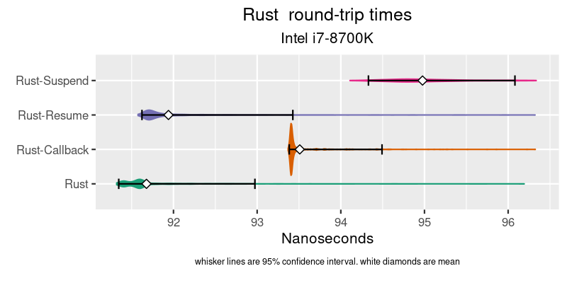
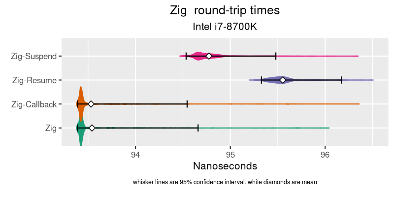
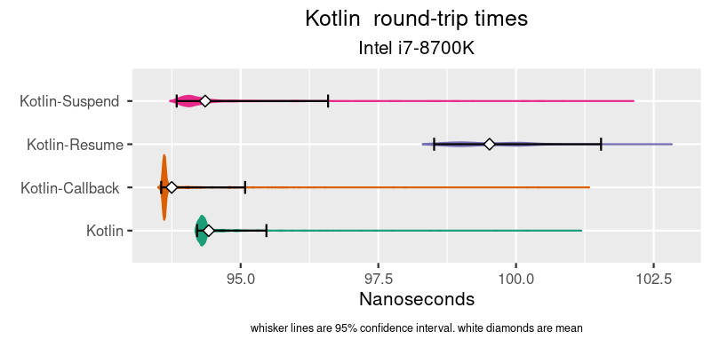

# async-benchmarks

##Benchmarking the overhead of coroutine vs callbacks in Rust, Zig, C++ & Koltin.


## Background

I used to work at places that specialize in Ultra Low Latency (ULL) development, like Stock Exchanges and High Frequency Trading and the like. You end up having to bypass good abstractions and libraries because of the overhead. A good example is : It is rare ULL code that does a context switch (takes too long). Single threaded only. If you want to communicate w/ another process, you use shared memory. ULL code rarely calls epoll/select either. Best to avoid the kernel as well (evfi,dkdp,openonload,etc). So you end up doing some sort of `while(!hasNewData()) {}` spinning event loop, waiting for memory to change, and when it does you enter callback-hell. The ergonomics suck. Or just give up and learn verilog, put your code on the card w/ the NIC and skip the PCIe bus/kernel/stack all together. Your shinny CPU now just branch predicting a glorified logger.

## Motovation

I recently did another project for a company in an adjacent industry, and I ended up using koltin coroutines for that project (not ULL, but still latency focused). It was great to write synchronous looking code that was concurrent. I really enjoyed that project. It made the code so much easier to write / reason about / read.

I might have another ULL project coming up, but they don't want to go the FPGA route (or as little as possible). So before that project happens I thought I would measure the overhead of coroutines vs callbacks. See how much the abstraction costs so I can make informed decisions about it's usage. I'm sharing this work in case anyone else cares.

## Methodology

I expected the coroutine overhead to be small, but to exist. I didn't want the base event/IO to dominate the results. So networking code was out. I decided to used shared memory instead and do a ping-pong test. The clint puts a `u64` in a memory location one, and times how long it takes that `u64` number to show up in memory location two. The server is spinning waiting for location one to change value, when it does it copies the new value to location two, then loops. Here is the server-side zig code, which I think is the easiest to follow:


<table>
<tr>
<td>

```zig
fn runLoop( clientPtr : *const u64, serverPtr : *u64 ) void {

    var lastValue : u64 = 0;

    while(true) {
        lastValue = spinUntilChange( clientPtr, lastValue );
        @atomicStore(u64, serverPtr, lastValue, std.builtin.AtomicOrder.Monotonic );
    }
}
fn spinUntilChange( spinPtr:*const u64, lastValue:u64) callconv(.Inline) u64 {

    var newValue = lastValue;

    while( newValue == lastValue ) {
        std.atomic.spinLoopHint();
        newValue = @atomicLoad(u64, spinPtr, std.builtin.AtomicOrder.Monotonic );
    }
    return newValue;
}
```

</td>
<td>

```asm
runLoop:
        xor     eax, eax
.LBB0_1:
        pause
        mov     rcx, qword ptr [rdi]
        cmp     rcx, rax
        je      .LBB0_1
        mov     qword ptr [rsi], rcx
        mov     rax, rcx
        jmp     .LBB0_1
```

</td>
</tr>
</table>

In C++,Rust & Zig I implmneted the pointer as both `volatile` and `Atomic`. It made no difference in the `asm` output. The Rust `asm` looks identical. C++ w/ clang looks identical, but gcc does a extra memory read in the inner loop. I did not export the resulting `asm` that the JIT optomizer came up with.

There is only one client, and it's in Rust. Mostly because the [criterion benchmarking crate](https://bheisler.github.io/criterion.rs/book/criterion_rs.html) is really great at this kind of microbenchmark stuff. So we're really only measure 1/2 the difference, assuming both sides use the same code. The `asm` for the client loop looks the same as the server loop.

For the async server code, this is the kotlin version which is probably the easiest to follow :
```kotlin
    suspend fun asyncLoop() {
        var value = 0L
        while(true) {
            value = suspendPoint.suspendMe()
            writeBuf.writeLong(0,value)
        }

    }

    fun run() {
        var nextValue = 0L;
        var lastValue = 0L;
        while(true) {
            while(nextValue == lastValue) {
                java.lang.Thread.onSpinWait();
                nextValue = readBuf.readLong(0)
            }
            suspendPoint.resume( nextValue )
            lastValue = nextValue
        }
    }
``` 
`asyncLoop()` is called first, then `run()` both from `main()`. It's odd to see two `while(true)` loops in single threaded code. The wonders of coroutines.

All the async version were written the same. The async code suspends while the event loop spins on memory. When the async code resumes w/ the new value, it writes it.


### Suspend vs Resume

The code flow for the async code looks like this `SpinLoop->Resume->WriteValue->Suspend::Loop` Since the client is measuring the time it takes from `SpinLoop` to `WriteValue`, it most likely isn't measuring the time `Suspend` takes. There is no reason to think the time to `Resume` is the same as to `Suspend`.

If the event loop is dispatching the same event to multiple listeners, or had multiple events to dispatch, you bear the cost of both the suspend and resume.

So I wrote two version of each async. The version above is called the `Resume` version. The `Suspend` version code flow look like `SpinLoop->Suspend->WriteValue->Resume::Loop`. In the `Suspend` version the `SpinLoop` is in the async code block, and the writing on the value is in the `eventLoop`. If the event loop is dispatching the same event to multiple listeners, or had multiple events to dispatch, you bear the cost of both the suspend and resume.

### Callbacks
The spin loop isn't a fair comparison to the async code, so I added a callback version. This is the version you should compare to the async code. I didn't write the reciprocal version of callback, like I did with the async code. I'm just going to assume returning from a callback is cheap, and not time it.

## Testing enviroment

I used the machines I have at home for this. One is an `Intel i7-8700K`, the other is a newer `AMD Ryzen 5 5600G`. All the tests were run on bare metal. VMs might be fine for this kind of test though. Both CPUs have 6 core, 2 CPUs per core. I rant a kernel w/ the `ioslcpu` param to isolate cores 5 & 6 (CPUs 4,5,10 & 11). I ran the client pinned to 4, and the server to 5. the AMD is headless, so easy to strip. The Intel is my dev box, so I'd boot to multi-user when running tests. Both are Ubuntu 20.04.
Each test did a 3 second warm up, then ran for 5 seconds. 1K of samples are taken from each run. You can read about [criterion's sampling methodology](https://bheisler.github.io/criterion.rs/book/user_guide/advanced_configuration.html#sampling-mode) if you are curious about that. It also has great graphing out of the box, but I love R's ggplot. JVM was Graal 11.0.12. Even with isolated CPUs, there was a fair bit of jitter between runs. Perhaps ubuntu isn't a good OS for this. So I ran all the benchmarks multiple times, and took the best run for each benchmark.

## Graphs
I show the plots by languages because I care about the additional overhead for a given language, not the difference between languages. But you can re-plot the data to compare languages if your interested in that.
I also commit the cardinal sin of not starting the y-axis at 0. I'm only intrested in the differences. Making it even harder to compare across languages.
The graphs also clip long tials. The don't go much past the worse benchmark's 95% confidence interval. I'm not interested in tails for this. Feel free to look at the JVM's long tails if you like.

## C++


I could not get GCC to produce the same asm that zig & Rust output. Clang did, but not GCC. Clang's coroutine support is beta-ish, so I went with GCC. The callbacks are implemented with lambda and `std::function` so if you do it a faster wait, account for that. The coroutine code blatantly stolen from [David Mazières excilent blog post](https://www.scs.stanford.edu/~dm/blog/c++-coroutines.html) and compiled with `gcc version 11.1.0`
### takeaways
* I think the AMD spin-loop coud be as fast as the zig/rust one, with some GCC tweaking. So just pretend it's at ~56ns-ish
* Resume is expensive, suspend is the same as a callback, which is impressive.
* Given that you'd bare the cost of both the suspend and resume for every IO event I'd say :
  * Seems like the faster the processor, the greater the async overhead in % terms. 
  * Maybe usable, benchmark on likely production hardware.


## Rust



Rust's async implementations is the most complicated by far. The resume code is obtuse. You call a `waker` which then calls `poll` on the `future` that then resumes. Callbacks are awkward in Rust because of the borrow checker, so I'm not sure that callbacks are the baseline to measure from in Rust. All this code was run on `release` version, with `native` target and `lto` enabled `rustc 1.55.0`. I am a intermediate Rust dev at best. I'd happily take any criticism and update this test.
### takeaways
* I can not explain why Suspend and Resume flip places on Intel vs AMD, which worries me.
* Despite my concern over all the resume code, it's snappy on Intel.
* I would do async on Rust because it's a better fit for the language.
* There are a bunch of other things in Rust that might not make it approprate for ULL code. But I've been quite impressed with it's ability to take all that typing and turn it into nothing at runtime, and I enjoy it over C++. More benchmarks needed.

## ZIG



Zig isn't even 1.0 yet, and it's main developer says not to deploy it in production, so maybe it shouldn't be here at all. But I had the most fun writing this version. `comptime` is super fun. This was made with compiler version `0.8.1`

### takeaways
* Like C++ the order stayed the same on both processors.
* Callbacks are really fast, or the compiler is good at finding them and in-lining them. It might not scale to dispatching multiple events to multiple listeners.
* Since you need to add both the Suspend and Resume time, zig is a bit slower than C++. Slightly disappointing.

## Kotlin



The kotlin project does not include the `kotlinx-coroutines-core` library. I just used the Coroutine support provided by the compiler. The library implments `aysnc` and `launch`, so neither of those are in the code. I used chronical's `OpenHFT/Affinity` and `OpenHFT/Bytes` pckages. `Bytes` for little-endian reading/writing to a buffer setup from a pointer. You could replace with `Unsafe.getLong()`. I used JNA for calls to shm_open / ftruncate / mmap. Make sure it's installed on your system if you want to run these. I ran these with JVM `GraalVM CE 21.2.0 (build 11.0.12+6-jvmci-21.2-b08, mixed mode, sharing)`.

### Takeaways
* The JIT can spit out some tight machine code. The spin version is right there with the others (except the tails)
* The difference between callbacks and async is smaller than I thought it would be. 
* The async version are still slower than the others. But if your already on the JVM I'd just use it.


## How to build run
The Rust stuff in the root directly. Just install Rust on your system and run `cargo build`

You'll need a JDK and gradle for the kotlin code. In the kotlin directly run `gradle build`

Have zig in your path (there is a snap for it). in the zig directory run `zig build`

In the `cpp` directory there are two scripts `setup` will create the target directories and make `cmake` aware of them. The `build` script builds both targets.

to run the tests, in the root directory run `cargo bench`

There are some other scripts specific to my enviroment. The `run_bench` sets a `nice` level before launching, and copies the data files between runs for later processing. The `setup_env` turns off some CPUs, and changes modes.

in `src\lib.rs` you can change which CPUs things run on.

The benchmark code generates html output repots. They are in the `target` directory someplace. The R code that generates these graphs is in `graphs`. If you know R, you know what to do. If you don't, I wouldn't bother.
 


