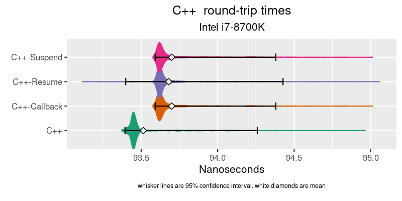
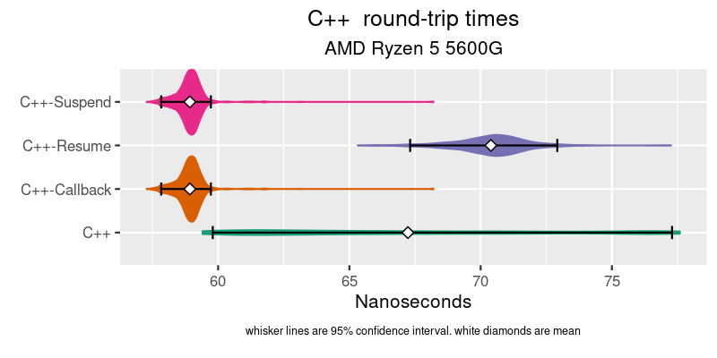
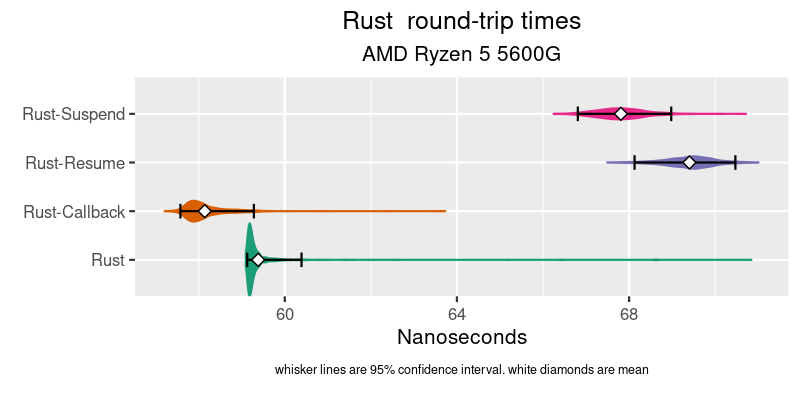
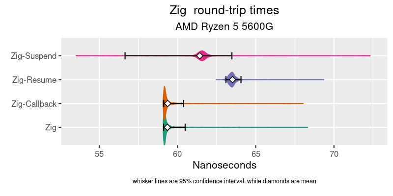
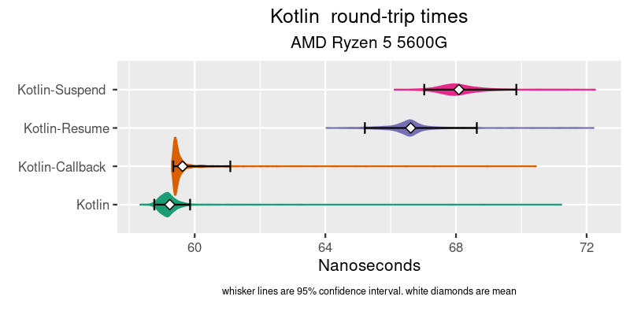

# async-benchmarks

## Benchmarking the overhead of coroutine vs callbacks in Rust, Zig, C++ & Koltin.


## Background

I used to work at places that specialize in Ultra Low Latency (ULL) development, like Stock Exchanges and High Frequency Trading and the like. You end up having to bypass good abstractions and libraries because of the overhead. A good example is : It is rare ULL code that does a context switch (takes too long). Single threaded only. If you want to communicate w/ another process, you use shared memory. ULL code rarely calls epoll/select either. Best to avoid the kernel as well (evfi,dkdp,openonload,etc). So you end up doing some sort of `while(!hasNewData()) {}` spinning event loop, waiting for memory to change, and when it does you enter callback-hell. The ergonomics suck. Or just give up and learn verilog, put your code on the card w/ the NIC and skip the PCIe bus/kernel/stack all together. Your shinny CPU now just branch predicting a glorified logger.

## Motovation

I recently did another project for a company in an adjacent industry and used koltin coroutines (not ULL, but still latency sensitive). It was great to write synchronous looking code that was concurrent. Coroutines made the code so much easier to write / reason about / read.

I have another ULL project coming up, so before that project happens I wanted to measure the overhead of coroutines vs callbacks. See how much the abstraction costs. See if the cost are a clear "no".

## Methodology

I didn't want the root event/IO being waited on to dominate the results. Which ruled out networking IO. I decided to used shared memory instead and do a ping-pong test. The clint puts a `u64` in a memory location one, and times how long it takes that `u64` number to show up in memory location two. The server is spinning waiting for location one to change value, when it does it copies the new value to location two, then loops. Here is the server-side zig code and the resulting `asm` according to [compiler explorer](https://godbolt.org/) :


<table>
<tr>
<td>

```zig
fn runLoop( clientPtr : *const u64, serverPtr : *u64 ) void {

    var lastValue : u64 = 0;

    while(true) {
        lastValue = spinUntilChange( clientPtr, lastValue );
        @atomicStore(u64, serverPtr, lastValue, std.builtin.AtomicOrder.Monotonic );
    }
}
fn spinUntilChange( spinPtr:*const u64, lastValue:u64) callconv(.Inline) u64 {

    var newValue = lastValue;

    while( newValue == lastValue ) {
        std.atomic.spinLoopHint();
        newValue = @atomicLoad(u64, spinPtr, std.builtin.AtomicOrder.Monotonic );
    }
    return newValue;
}
```

</td>
<td>

```asm
runLoop:
        xor     eax, eax
.LBB0_1:
        pause
        mov     rcx, qword ptr [rdi]
        cmp     rcx, rax
        je      .LBB0_1
        mov     qword ptr [rsi], rcx
        mov     rax, rcx
        jmp     .LBB0_1
```

</td>
</tr>
</table>

In C++,Rust & Zig I implemented the pointer as both `volatile` and `Atomic`. It made no difference in the `asm` output. If you remove the `spinLoopHint()` the AMD times get worse by ~50%. It seems to make no difference on Intel, so I left it in.

There is only one client, and it's in Rust, and it's a spin-loop. Mostly because the [criterion benchmarking crate](https://bheisler.github.io/criterion.rs/book/criterion_rs.html) is really great at this kind of micro-benchmark work. The `asm` for the client is similar to the server above.

For the coroutine server code, this is the kotlin version which is probably the easiest to follow :
```kotlin
    suspend fun asyncLoop() {
        var value = 0L
        while(true) {
            value = suspendPoint.suspendMe()
            writeBuf.writeLong(0,value)
        }

    }

    fun run() {
        var nextValue = 0L;
        var lastValue = 0L;
        while(true) {
            while(nextValue == lastValue) {
                java.lang.Thread.onSpinWait();
                nextValue = readBuf.readLong(0)
            }
            suspendPoint.resume( nextValue )
            lastValue = nextValue
        }
    }
``` 
`asyncLoop()` is called first, then `run()` both from `main()`. It's odd to see two `while(true)` loops in single threaded code. The magic of coroutines.

All the coroutine version were written the same. The coroutine code suspends while the event loop spins on memory. When the coroutine code resumes w/ the new value, it writes it.


### Suspend vs Resume

The code flow for the coroutine code looks like this `SpinLoop->Resume->WriteValue->Suspend::Loop` Since the client is measuring the time it takes from `SpinLoop` to `WriteValue`, it most likely isn't measuring the time `Suspend` takes. There is no reason to think the time to `Resume` is the same as to `Suspend`.

If the event loop is dispatching the same event to multiple listeners, or had multiple events to dispatch, you bear the cost of both the suspend and resume for each event.

So I wrote two version of each coroutine. The version above is called the `Resume` version. The `Suspend` version code flow look like `SpinLoop->Suspend->WriteValue->Resume::Loop`. In the `Suspend` version the `SpinLoop` is in the coroutine code block, and the writing of the value is in the `eventLoop`.

### Callbacks
The spin loop isn't a fair comparison to the coroutine code, so I added a callback version. I didn't write the reciprocal version of callback, like I did with the coroutine code. I'm just going to assume returning from a callback is cheap.

## Testing enviroment

I used the machines I have at home for this. One is an `Intel i7-8700K`, the other is a newer `AMD Ryzen 5 5600G`. Both CPUs have 6 core, 2 CPUs per core. The kernel has the `ioslcpu` param to isolate cores 5 & 6 (CPUs 4,5,10 & 11). The is client pinned to 4, and the server to 5. the AMD is headless, so easy to strip. The Intel is my dev box, so I'd boot to multi-user when running tests. Both are Ubuntu 20.04.
Each test did a 3 second warm up, then ran for 5 seconds. 1K of samples are taken from each run. You can read about [criterion's sampling methodology here](https://bheisler.github.io/criterion.rs/book/user_guide/advanced_configuration.html#sampling-mode). Critersion graphing out of the box, but I love R's ggplot. Even with isolated CPUs, there was a fair bit of jitter between runs on the Intel. I ran all the benchmarks multiple times, and took the best run for each benchmark. "Best" is the run w/ the smallest value for upper 95% confidence interval.

## Graphs
The plots are by languages to compare the additional overhead for a given language, not the difference between languages. The plots do not start x-axis at 0. This is to accentuate the differences. This makes it even harder to compare across languages.
The graphs clip long tails. the graphs cut off a bit past the worst 95% confidence interval. For this test, tails are more likely because of a bad test environment than actual jitter in the tests.

## C++



I could not get GCC to produce the same `asm` that zig & Rust output. Clang did, but not GCC. Clang's coroutine support is still experimental, so I went with GCC. The callbacks are implemented with a lambda and `std::function`. The coroutine code blatantly stolen from [David Mazières excilent blog post](https://www.scs.stanford.edu/~dm/blog/c++-coroutines.html) and compiled with `gcc version 11.1.0`
### takeaways
* Likely the AMD spin-loop could be as fast as the zig/rust one, with some GCC tweaking. Just pretend it's at ~56ns-ish
* Resume is expensive on AMD, suspend is the same as a callback, which is impressive.


## Rust



Rust's async/await implementations is the most complicated by far. The resume code is obtuse. You call a `waker` which then calls `poll` on the `future` that then resumes. Callbacks are awkward in Rust because of the borrow checker, so callbacks might not be the baseline to measure from. All this code was run on `release` version, with `native` target and `lto` enabled `rustc 1.55.0`. Writing this code felt like I'm not using async/await the way it was intended. I just shoved into a coroutine looking box. I am an intermediate Rust dev at best. Criticism welcome.
### takeaways
* I can not explain why Suspend and Resume flip places on Intel vs AMD.
* Despite concern about resume complexity, it's snappy on Intel.
* I would use async/await for Rust because it's a better fit for the language.
* There are other issues in Rust that might make it inappropriate for ULL code w/o a profusion of `unsafe`. This specific test does not point to any issues. Promising.

## ZIG



Zig isn't even 1.0 yet, and it's creator says not to deploy it in production. Maybe it shouldn't be here at all. But I enjoyed writing this version the most. `comptime` is super fun. This was made with compiler version `0.8.1`

### takeaways
* Callbacks are really fast, or the compiler is good at finding them and in-lining them. It might not scale to dispatching multiple events to multiple listeners.
* Potential for C++ replacement for ULL work, if you can get over no traits or interfaces.

## Kotlin



The kotlin project does not include the `kotlinx-coroutines-core` library. Just the Coroutine support provided by the compiler is used. The library implements `aysnc` and `launch`, so neither of those are in the code. Chronical's `OpenHFT/Affinity` and `OpenHFT/Bytes` packages are used. `Bytes` for little-endian reading/writing to a buffer setup from a pointer. You could replace with `Unsafe.getLong()`. I used JNA for calls to `shm_open` / `ftruncate` / `mmap`. Make sure it's installed if you want to run these. These were run with JVM `GraalVM CE 21.2.0 (build 11.0.12+6-jvmci-21.2-b08, mixed mode, sharing)`.

### Takeaways
* The JIT can generate some tight machine code. The spin version is right there with the others (except the tails)
* The difference between callbacks and coroutines is smaller than I had assumed. Coroutines isn't a native JVM concept (yet), it entirely done by the kotlin compiler. 
* If your already on the JVM, just use coroutines. You have other more important latency worries.

## Final Thoughts
The absolute value of the different between coroutines and callbacks is small. That is impressive on its own. From the two machines tested, as the CPU gets faster the absolute value stays about the same, so the difference in % terms increases. It's only a sample of 2 different hardware setups. Might mean nothing.

Use coroutines, or not? I don't think these numbers point to a firm "no". These types of micro-benchmarks do not do a good job of predicting the effect on an actual codebase doing real work. It could be that the layout of the code/data with coroutines improves/degrades your cache hit rate, which could have a far larger effect than callback vs coroutine. Summary? typical : "It Depends".

## How to build run
The Rust stuff in the root directly. Just install Rust on your system and run `cargo build`

You'll need a JDK and gradle for the kotlin code. In the kotlin directly run `gradle build`

Have zig in your path (there is a snap for it). in the zig directory run `zig build`

In the `cpp` directory there are two scripts `setup` will create the target directories and set `cmake` for them. The `build` script builds both targets. GCC 11+ required.

to run the tests, in the root directory run `cargo bench`

There are some other scripts specific to my environments. The `run_bench` sets a `nice` level before launching, and copies the data files between runs for later processing. The `setup_env` turns off some CPUs, and changes cpu modes.

in `src\lib.rs` you can change which CPUs things run on.

The benchmark suite generates html output reports. They are in the `target` directory someplace. The R code that generates these graphs is in `graphs`.
 


